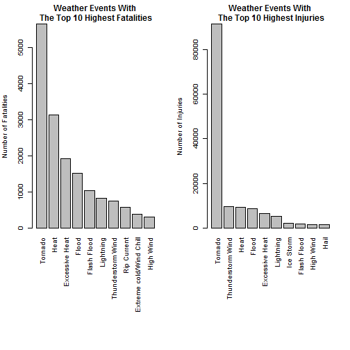
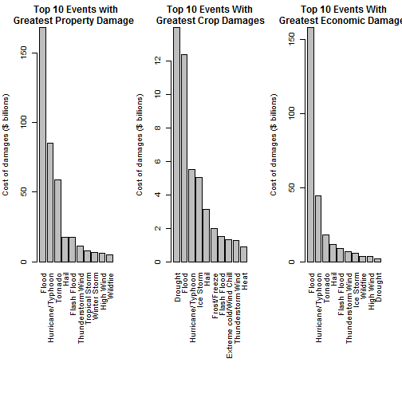

# 1. Introduction
Storms and other severe weather events can cause both public health and economic problems for communities and municipalities. Many severe events can result in fatalities, injuries, and property damage, and preventing such outcomes to the extent possible is a key concern.

This project involves exploring the U.S. National Oceanic and Atmospheric Administration’s (NOAA) storm database. This database tracks characteristics of major storms and weather events in the United States, including when and where they occur, as well as estimates of any fatalities, injuries, and property damage.

# Data Processing.
The data National Weather Service Storm Data for this assignment is come in the form of a comma-separated-value file compressed via the bzip2 algorithm.

## loading libraries.

```r
library('knitr')
library('rmarkdown')
library('markdown')
library('ggplot2')
library('R.utils')
```
## Download the data and unzip it.

```r
if (!"StormData.csv.bz2" %in% dir("./")) {
    download.file("http://d396qusza40orc.cloudfront.net/repdata%2Fdata%2FStormData.csv.bz2", destfile = "StormData.csv.bz2")
}
```
## Generate csv file.

```r
if (!"storm" %in% ls()) {
    storm <- read.csv(bzfile("StormData.csv.bz2"), sep = ",", header = TRUE, stringsAsFactors = FALSE)
}
dim(storm)
```

```
## [1] 902297     37
```
## Extract data as per event.

```r
events <- c("Astronomical Low Tide", "Avalanche", "Blizzard", "Coastal Flood", "Cold/Wind Chill", "Debris Flow", "Dense Fog", "Dense Smoke", "Drought", "Dust Devil", "Dust Storm", "Excessive Heat", "Extreme cold/Wind Chill", "Flash Flood", "Flood", "Freezing", "Frost/Freeze", "Funnel Cloud", "Hail", "Heat", "Heavy Rain", "Heavy Snow", "High Surf", "High Wind", "Hurricane/Typhoon", "Ice Storm", "Lakeshore Flood", "Lake-Effect Snow", "Lightning", "Marine Hail", "Marine High Wind", "Marine Strong Wind", "Marine Thunderstorm Wind", "Rip Current", "Seiche", "Sleet", "Storm Tide", "Strong Wind", "Thunderstorm Wind", "Tornado", "Tropical Depression", "Tropical Storm", "Tsunami", "Volcanic Ash", "Waterspout", "Wildfire", "Winter Storm", "Winter Weather")
```
## For combined event.

```r
events_regex <- c("Astronomical Low Tide|Low Tide", "Avalanche", "Blizzard", "Coastal Flood", "Cold/Wind Chill", "Debris Flow", "Dense Fog", "Dense Smoke", "Drought", "Dust Devil", "Dust Storm", "Excessive Heat", "Extreme cold/Wind Chill|Extreme Cold|Wind Chill", "Flash Flood", "Flood", "Freezing", "Frost/Freeze|Frost|Freeze", "Funnel Cloud", "Hail", "Heat", "Heavy Rain", "Heavy Snow", "High Surf", "High Wind", "Hurricane/Typhoon|Hurricane|Typhoon", "Ice Storm", "Lakeshore Flood", "Lake-Effect Snow", "Lightning", "Marine Hail", "Marine High Wind", "Marine Strong Wind", "Marine Thunderstorm Wind|Marine tstm Wind", "Rip Current", "Seiche", "Sleet", "Storm Tide", "Strong Wind", "Thunderstorm Wind|tstm wind", "Tornado", "Tropical Depression", "Tropical Storm", "Tsunami", "Volcanic Ash", "Waterspout", "Wildfire", "Winter Storm", "Winter Weather")  
```

## Extract rows corresponding to the event.
* EVTYPE - Type of event
* FATALITIES - Number of fatalities
* INJURIES - Number of injuries
* PROPDMG - Amount of property damage in orders of magnitude
* PROPDMGEXP - Order of magnitude for property damage (e.g. K for thousands)
* CROPDMG - Amount of crop damage in orders of magnitude
* PROPDMGEXP - Order of magnitude for crop damage (e.g. M for millions)


```r
options(scipen = 999)  # force fixed notation of numbers instead of scientific
cleandata <- data.frame(EVTYPE = character(0), FATALITIES = numeric(0), INJURIES = numeric(0), PROPDMG = numeric(0), PROPDMGEXP = character(0), CROPDMG = numeric(0), CROPDMGEXP = character(0))  
for (i in 1:length(events)) {
rows <- storm[grep(events_regex[i], ignore.case = TRUE, storm$EVTYPE), ]
rows <- rows[, c("EVTYPE", "FATALITIES", "INJURIES", "PROPDMG", "PROPDMGEXP", "CROPDMG", "CROPDMGEXP")]
CLEANNAME <- c(rep(events[i], nrow(rows)))
rows <- cbind(rows, CLEANNAME)
cleandata <- rbind(cleandata, rows)
}
```

## Order of magnitude of property and crop damage
(H = hundreds, K = thousands, M = millions, B= billions)


```r
## convert letter exponents to integers
cleandata[(cleandata$PROPDMGEXP == "K" | cleandata$PROPDMGEXP == "k"), ]$PROPDMGEXP <- 3
cleandata[(cleandata$PROPDMGEXP == "M" | cleandata$PROPDMGEXP == "m"), ]$PROPDMGEXP <- 6
cleandata[(cleandata$PROPDMGEXP == "B" | cleandata$PROPDMGEXP == "b"), ]$PROPDMGEXP <- 9
cleandata[(cleandata$CROPDMGEXP == "K" | cleandata$CROPDMGEXP == "k"), ]$CROPDMGEXP <- 3
cleandata[(cleandata$CROPDMGEXP == "M" | cleandata$CROPDMGEXP == "m"), ]$CROPDMGEXP <- 6
cleandata[(cleandata$CROPDMGEXP == "B" | cleandata$CROPDMGEXP == "b"), ]$CROPDMGEXP <- 9
```

## Compute combined economic damage (property damage + crops damage)

```r
suppressWarnings(cleandata$PROPDMG <- cleandata$PROPDMG * 10^as.numeric(cleandata$PROPDMGEXP))  
suppressWarnings(cleandata$CROPDMG <- cleandata$CROPDMG * 10^as.numeric(cleandata$CROPDMGEXP))
suppressWarnings(TOTECODMG <- cleandata$PROPDMG + cleandata$CROPDMG)
cleandata <- cbind(cleandata, TOTECODMG)
cleandata <- cleandata[, c("EVTYPE", "FATALITIES", "INJURIES", "PROPDMG", "CROPDMG", "CLEANNAME", "TOTECODMG")]
```

# 2. Graph ploting

## Fatalities

```r
fatalities <- aggregate(FATALITIES ~ CLEANNAME, data = cleandata, FUN = sum)
fatalities <- fatalities[order(fatalities$FATALITIES, decreasing = TRUE), ]
MaxFatalities <- fatalities[1:10, ]
print(MaxFatalities)
```

```
##                  CLEANNAME FATALITIES
## 38                 Tornado       5661
## 19                    Heat       3138
## 11          Excessive Heat       1922
## 14                   Flood       1525
## 13             Flash Flood       1035
## 28               Lightning        817
## 37       Thunderstorm Wind        753
## 33             Rip Current        577
## 12 Extreme cold/Wind Chill        382
## 23               High Wind        299
```

## Injuries

```r
injuries <- aggregate(INJURIES ~ CLEANNAME, data = cleandata, FUN = sum)
injuries <- injuries[order(injuries$INJURIES, decreasing = TRUE), ]
MaxInjuries <- injuries[1:10, ]
print(MaxInjuries)
```

```
##            CLEANNAME INJURIES
## 38           Tornado    91407
## 37 Thunderstorm Wind     9493
## 19              Heat     9224
## 14             Flood     8604
## 11    Excessive Heat     6525
## 28         Lightning     5232
## 25         Ice Storm     1992
## 13       Flash Flood     1802
## 23         High Wind     1523
## 18              Hail     1467
```

## Graph of Total Fatalities and Total Injuries

```r
par(mfrow = c(1, 2), mar = c(15, 4, 3, 2), mgp = c(3, 1, 0), cex = 0.8)
barplot(MaxFatalities$FATALITIES, las = 3, names.arg = MaxFatalities$CLEANNAME, main = "Weather Events With\n The Top 10 Highest Fatalities", ylab = "Number of Fatalities", col = "grey")
barplot(MaxInjuries$INJURIES, las = 3, names.arg = MaxInjuries$CLEANNAME, main = "Weather Events With\n The Top 10 Highest Injuries", ylab = "Number of Injuries", col = "grey")
```



## Property damage

```r
propdmg <- aggregate(PROPDMG ~ CLEANNAME, data = cleandata, FUN = sum)
propdmg <- propdmg[order(propdmg$PROPDMG, decreasing = TRUE), ]
propdmgMax <- propdmg[1:10, ]
print(propdmgMax)
```

```
##            CLEANNAME      PROPDMG
## 14             Flood 168212215589
## 24 Hurricane/Typhoon  85356410010
## 38           Tornado  58603317864
## 18              Hail  17622990956
## 13       Flash Flood  17588791879
## 37 Thunderstorm Wind  11575228673
## 40    Tropical Storm   7714390550
## 45      Winter Storm   6749997251
## 23         High Wind   6166300000
## 44          Wildfire   4865614000
```

## Crop damage

```r
cropdmg <- aggregate(CROPDMG ~ CLEANNAME, data = cleandata, FUN = sum)
cropdmg <- cropdmg[order(cropdmg$CROPDMG, decreasing = TRUE), ]
cropdmgMax <- cropdmg[1:10, ]
print(cropdmgMax)
```

```
##                  CLEANNAME     CROPDMG
## 8                  Drought 13972621780
## 14                   Flood 12380109100
## 24       Hurricane/Typhoon  5516117800
## 25               Ice Storm  5022113500
## 18                    Hail  3114212870
## 16            Frost/Freeze  1997061000
## 13             Flash Flood  1532197150
## 12 Extreme cold/Wind Chill  1313623000
## 37       Thunderstorm Wind  1255947980
## 19                    Heat   904469280
```

## Economic damage

```r
ecodmg <- aggregate(TOTECODMG ~ CLEANNAME, data = cleandata, FUN = sum)
ecodmg <- ecodmg[order(ecodmg$TOTECODMG, decreasing = TRUE), ]
ecodmgMax <- ecodmg[1:10, ]
print(ecodmgMax)
```

```
##            CLEANNAME    TOTECODMG
## 14             Flood 157764680787
## 24 Hurricane/Typhoon  44330000800
## 38           Tornado  18172843863
## 18              Hail  11681050140
## 13       Flash Flood   9224527227
## 37 Thunderstorm Wind   7098296330
## 25         Ice Storm   5925150850
## 44          Wildfire   3685468370
## 23         High Wind   3472442200
## 8            Drought   1886667000
```

## Graph of Total Property Damages, Total Crop Damages and Total Economic Damages

```r
par(mfrow = c(1, 3), mar = c(15, 4, 3, 2), mgp = c(3, 1, 0), cex = 0.8)
barplot(propdmgMax$PROPDMG/(10^9), las = 3, names.arg = propdmgMax$CLEANNAME, main = "Top 10 Events with\n Greatest Property Damages", ylab = "Cost of damages ($ billions)", col = "grey")
barplot(cropdmgMax$CROPDMG/(10^9), las = 3, names.arg = cropdmgMax$CLEANNAME, main = "Top 10 Events With\n Greatest Crop Damages", ylab = "Cost of damages ($ billions)", col = "grey")
barplot(ecodmgMax$TOTECODMG/(10^9), las = 3, names.arg = ecodmgMax$CLEANNAME, main = "Top 10 Events With\n Greatest Economic Damages", ylab = "Cost of damages ($ billions)", col = "grey")
```



# Conclusion
Flood is the major cause with respect to cost of damage.
Tornado are most harmful with respect to population health.
